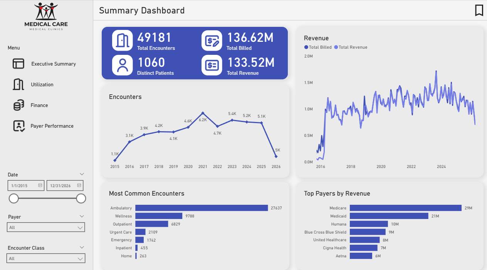

# Timothy Tam
## About me

Data analyst and data engineer with a background in biology, psychiatric research, and computer science — UCI-trained and self-driven. Passionate about transforming healthcare and any operational data into actionable insights through SQL, Python, Power BI, and ETL workflows.

My projects span across healthcare analytics dashboards, CMS Open Payments ETL pipelines, and COVID-19 risk analysis using real and synthetic datasets. Interested in roles where data engineering, analytics, and backend systems intersect to drive better decisions.

## Projects

- 🏥 **[Healthcare Analytics Dashboard](https://github.com/imtimtam/healthcare-analytics-dashboard)**  
  An analysis of healthcare operations and revenue cycles with synthetic data generated by Synthea. This utilizes SQL queries, DAX, and a Power BI dashboard to explore utlization, finances, and the performance of the most used payers.

  

    
     
    <em>A healthcare analysis dashboard involving well-known payer performance.</em>
  

- 🏥 **[CA COVID-19 Analysis](https://github.com/imtimtam/covid_ca_county_analysis)**  
  An analysis of COVID-19 outcomes and risk factors across California counties in 2020. It combines SQL queries, Excel pivot tables, and a Power BI dashboard to explore cases, deaths, and sociodemographic and healthcare risk factors.

  

    
     
    <em>An interactive analysis overview generated in Power BI.</em>
  

- ⚕️ **[Drug Library Frontend](https://github.com/imtimtam/ddi-web)**  
  A clean React + Vite frontend for exploring drug interactions and targets. Designed with **components**, **BEM**, **CSS variables**, and **responsive layouts**. Works with the API found below.

  

    
     
    <em>View potential interactions and reported adverse events instantly.</em>
  

- 💵 **[CMS Open Payment ETL](https://github.com/imtimtam/kolink-payments-etl)**  
  A file-based ETL for ingesting, cleaning and unifying CMS Open Payments for General and Research yearly payments. Built with Python, Pandas, and simple file-based workflows during an internship dedicated towards an MVP about linking key opinion leaders.

- 💊 **[Drug Interaction API](https://github.com/imtimtam/ddi-api)**  
  A Python backend API that integrates real datasets (nSIDES TWOSIDES + IUPHAR Guide to Pharmacology) to check drug-drug interactions and shared targets.  

- 🎲 **[Gacha Simulator](https://github.com/imtimtam/gacha-simulator)**  
  A probability-based gacha pull simulator built in Python with OOP design principles.  

## Tech Stack

- **Languages**: Python, Java, JavaScript/TypeScript, C++, HTML5, CSS3, SQL
- **Frameworks & Libraries**: React, FastAPI, Pandas, SQLAlchemy
- **Tools & Services**: VSCode, Git, GitHub, MySQL, PostgreSQL, Excel, PowerBI

## Connect with Me

- GitHub: [@imtimtam](https://github.com/imtimtam)  
- LinkedIn: [https://www.linkedin.com/in/timothy-tam](https://www.linkedin.com/in/timothy-tam-776482173/)
