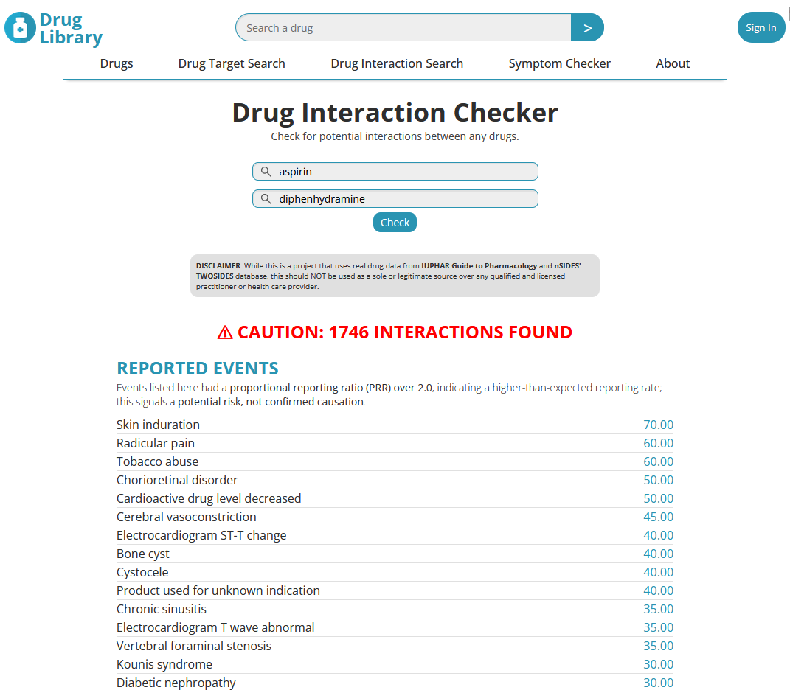

# Timothy Tam
## About me

I’m a UCI graduate with a B.S. in Biology, an A.S. in Computer Science and some experience in Psychiatric research trying to pivot as a data analyst/engineer with a growing passion for technology with a desire to solve problems and learn new things.

---

## Projects

- 🏥 **[CA COVID-19 Analysis](https://github.com/imtimtam/covid_ca_county_analysis)**  
  An analysis of COVID-19 outcomes and risk factors across California counties in 2020. It combines SQL queries, Excel pivot tables, and a Power BI dashboard to explore cases, deaths, and sociodemographic and healthcare risk factors.

  

    
     
    <em>An interactive analysis overview generated in Power BI.</em>
  

- ⚕️ **[Drug Library Frontend](https://github.com/imtimtam/ddi-web)**  
  A clean React + Vite frontend for exploring drug interactions and targets. Designed with **components**, **BEM**, **CSS variables**, and **responsive layouts**. Works with the API found below.

  

    
     
    <em>View potential interactions and reported adverse events instantly.</em>
  

- 💵 **[CMS Open Payment ETL](https://github.com/imtimtam/kolink-payments-etl)**  
  A file-based ETL for ingesting, cleaning and unifying CMS Open Payments for General and Research yearly payments. Built with Python, Pandas, and simple file-based workflows during an internship dedicated towards an MVP about linking key opinion leaders.

- 💊 **[Drug Interaction API](https://github.com/imtimtam/ddi-api)**  
  A Python backend API that integrates real datasets (nSIDES TWOSIDES + IUPHAR Guide to Pharmacology) to check drug-drug interactions and shared targets.  

- 🎲 **[Gacha Simulator](https://github.com/imtimtam/gacha-simulator)**  
  A probability-based gacha pull simulator built in Python with OOP design principles.  

---

## Tech Stack

- **Languages**: Python, Java, JavaScript/TypeScript, C++, HTML5, CSS3, SQL
- **Frameworks & Libraries**: React, FastAPI, Pandas, SQLAlchemy
- **Tools & Services**: VSCode, Git, GitHub, MySQL, PostgreSQL, Excel, PowerBI

---

## Connect with Me

- GitHub: [@imtimtam](https://github.com/imtimtam)  
- LinkedIn: [https://www.linkedin.com/in/timothy-tam](https://www.linkedin.com/in/timothy-tam-776482173/)
